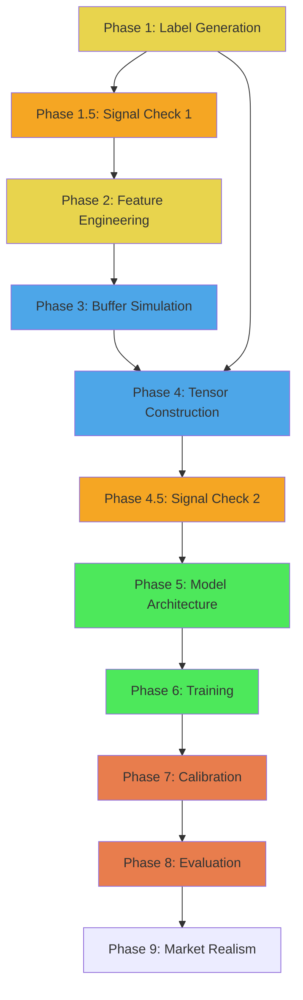

# BrickOfTicks Training Pipeline — Implementation Plan

> **Scope**: Offline training pipeline only. All phases below produce artifacts needed to train and evaluate the dual-head CNN+LSTM model. Execution engine is deferred.

---

## Project Structure

```
Overshot/
├── Data/
│   └── Raw/
│       ├── Ticks/{year}/{month}/{day}.parquet     # L1 tick data
│       ├── renko_with_tick_outcomes_no_be_XAUUSD20-24.csv
│       └── renko_with_tick_outcomes_no_be_24_local.csv
├── src/
│   ├── label_generator.py        # Phase 1: y_mag from L1 tick scan
│   ├── feature_engine.py         # Phase 2: 9D tick vector + 3D macro
│   ├── buffer_sim.py             # Phase 3: Micro-Buffer + Macro-History simulation
│   ├── tensor_builder.py         # Phase 4: Construct (N,10,100,9) + (N,10,3)
│   ├── model.py                  # Phase 5: CNN+LSTM dual-head architecture
│   ├── train.py                  # Phase 6: Training loop + walk-forward split
│   ├── calibrate.py              # Phase 7: Threshold calibration on val set
│   └── evaluate.py               # Phase 8: Final evaluation on test set
├── tests/
│   ├── test_label_generator.py
│   ├── test_feature_engine.py
│   ├── test_buffer_sim.py
│   ├── test_tensor_builder.py
│   └── test_model.py
├── outputs/
│   ├── labels.parquet
│   ├── features/                 # Cached feature arrays per brick
│   ├── tensors/                  # Final tensor dataset
│   ├── model.keras
│   └── config.json               # Calibrated thresholds
├── notebooks/                    # Optional analysis/debugging
├── prd.md
├── implementation.md
└── tasks.md
```

---

## Phase 1: Label Generation (`src/label_generator.py`)

### Objective
Enrich every Renko brick with `y_class`, `y_mag`, and `duration_seconds` by scanning L1 tick data.

### Input
- Renko CSV (30,978 rows)
- L1 tick parquets (`Data/Raw/Ticks/`)

### Algorithm

```
For each brick i in Renko CSV:
    1. Parse brick_close_time from 'date' column
    2. Determine direction: uptrend=True → LONG, uptrend=False → SHORT
    3. entry_price = brick.close
    4. tp_level = entry + brick_size (LONG) or entry - brick_size (SHORT)
    5. sl_level = entry - brick_size (LONG) or entry + brick_size (SHORT)
    6. Load L1 ticks starting from brick_close_time
    7. Hybrid Overshoot Scan:
       peak = entry_price
       tp_hit = False
       FOR tick in future_ticks:
           mid = (bid + ask) / 2
           peak = max(peak, mid) [LONG] or min(peak, mid) [SHORT]

           IF not tp_hit:  # Phase 1: SL-bounded
               IF mid hits TP → tp_hit = True, continue
               IF mid hits SL → BREAK (LOSS)
           ELSE:           # Phase 2: Trailing reversal
               IF mid retraces 1 brick_size from peak → BREAK

       y_mag = abs(peak - entry) / brick_size
    8. y_class = 1 if tp_hit else 0  (from hybrid algorithm, NOT CSV)
    9. csv_outcome_match = (y_class == (1 if CSV.outcome == 'WIN' else 0))
   10. If tick data gap: exclude_flag = True
   11. duration_seconds = time between this brick close and next brick close
```

**Result**: LOSS bricks get `y_mag ∈ [0, ~1.0)`, WIN bricks get `y_mag ∈ [1.0, ∞)`. Natural boundary at 1.0.

### Key Implementation Details

- **Mid-price**: All tick prices use `mid = (bid + ask) / 2`. The original CSV used bid-only pricing. Mid-price matches the feature pipeline's convention.
- **y_class from hybrid**: `y_class = 1 if tp_hit else 0`. The CSV `outcome` column is kept as a validation reference but is NOT used as the label.
- **Tick file loading**: Each day is one parquet file. A brick's overshoot scan may span multiple days. Load files sequentially as needed.
- **Performance**: Use vectorized operations where possible. Pre-load tick data by date range rather than file-by-file.
- **y_mag ranges**: LOSS bricks → `[0, ~1.0)` (peak before SL), WIN bricks → `[1.0, ∞)` (TP + trailing extension).
- **Assign `brick_id`**: Global integer counter starting at 0.

### Output
`outputs/labels.parquet` with columns:
```
brick_id, date, open, high, low, close, volume, uptrend, brick_size, sequence,
outcome, y_class, y_mag, duration_seconds, exclude_flag, csv_outcome_match
```

### Verification
1. Assert `y_mag >= 0.0` for all rows
2. Assert `y_mag < 1.0` for all `y_class == 0` rows and `y_mag >= 1.0` for all `y_class == 1` rows
3. Report CSV outcome mismatch rate: `sum(~csv_outcome_match) / total`. Expected 5–10%, investigate if > 15%
4. Plot y_mag histogram of mismatched bricks. Assert >80% have `y_mag ∈ [0.85, 1.15]` (boundary effect confirmation)
5. Print y_mag distribution stats: mean/median/std/min/max for WIN and LOSS separately
6. Count and report excluded labels (tick data gaps)

#### Phase 1 Results (Empirical)

- Check 1: ✅ PASS
- Check 2: ✅ PASS — LOSS max=0.999998, WIN min=1.000191
- Check 3: ✅ PASS — mismatch rate = 8.0% (2,431/30,563)
- Check 4: ⚠️ Boundary clustering was 33.5%, not >80%. Root cause: the CSV used a different reversal algorithm entirely, not just bid-only pricing. **Replaced with directional consistency check** (>90% threshold): actual 98.1%. LONG mismatches 97.7% LOSS→WIN, SHORT mismatches 98.5% WIN→LOSS. This proves systematic mid-vs-bid bias, not data corruption.
- Check 5: ✅ PASS — LOSS mean=0.353 std=0.295, WIN mean=2.086 std=1.175
- Check 6: ✅ PASS — 415 excluded (1.34%)

---

## Phase 1.5: Signal Existence Checkpoint 1 (`src/signal_check.py`)

### Objective
Verify that raw microstructure features carry measurable signal for predicting y_class before investing in expensive feature engineering.

### Algorithm

```
1. Load labels.parquet from Phase 1
2. For each brick (non-excluded):
   - Load the last tick before brick close from L1 tick data
   - Compute raw features at that tick:
     a. raw_ofi = e_k (using previous tick for delta)
     b. raw_velocity = 1 / (t_k - t_{k-1} + 1e-3)
     c. raw_spread = ask - bid
3. Compute point-biserial correlation:
   - r_ofi = pearsonr(raw_ofi, y_class)
   - r_vel = pearsonr(raw_velocity, y_class)
   - r_spread = pearsonr(raw_spread, y_class)
4. Print results with significance levels
5. Decision gate:
   - RED (all |r| < 0.02): Log warning, proceed with caution
   - GREEN (any |r| > 0.03): Signal confirmed
   - AMBER (0.02-0.03): Weak signal, rely on non-linear patterns
```

### Output
- `outputs/signal_check_1.json` with correlation values and decision
- Console printout of results

#### Phase 1.5 Results (Empirical)

| Feature | r | |r| | p-value | Significance |
|---|---|---|---|---|
| raw_ofi | +0.099 | 0.099 | 4.9e-67 | *** |
| raw_spread | -0.097 | 0.097 | 7.3e-64 | *** |
| raw_velocity | +0.001 | 0.001 | 0.86 | ns |

- **Decision: 🟢 GREEN** — raw_ofi and raw_spread both have |r| > 0.03 (actually > 0.09)
- 30,427/30,563 bricks successfully extracted, 136 skipped
- OFI and spread carry strong linear signal at brick-close timescale
- Velocity is not significant — tick arrival rate alone doesn't predict outcome

---

## Phase 2: Feature Engineering (`src/feature_engine.py`)

### Objective
For every tick in the dataset, compute the 9-dimensional feature vector. For every brick, compute the 3D macro-vector.

### The 9D Tick Feature Vector

Each tick produces a 9-element vector using the following formulas:

#### Z-Scored Features (5) — Rolling window of 1000 ticks

| # | Feature | Raw Value | Z-Score |
|---|---|---|---|
| 1 | `z_OFI` | `e_k = I(dBid>=0)*q^B_k - I(dBid<=0)*q^B_{k-1} - I(dAsk<=0)*q^A_k + I(dAsk>=0)*q^A_{k-1}` | `(e_k - μ) / σ` |
| 2 | `z_Depth` | `D_k = q^B_k + q^A_k` | `(D_k - μ) / σ` |
| 3 | `z_Susc` | `S_raw = e_k / (D_k + 1e-8)` — divide RAW first, THEN z-score | `(S_raw - μ) / σ` |
| 4 | `z_Vel` | `V_k = 1 / (t_k - t_{k-1} + 1e-3)` — t in milliseconds | `(V_k - μ) / σ` |
| 5 | `z_Spread` | `S_k = ask_k - bid_k` | `(S_k - μ) / σ` |

**OFI Weak Inequality detail**:
```python
dBid = bid_k - bid_{k-1}
dAsk = ask_k - ask_{k-1}

# Weak inequalities: >= and <= (NOT strict > and <)
e_k = (
    (1 if dBid >= 0 else 0) * bid_vol_k
  - (1 if dBid <= 0 else 0) * bid_vol_{k-1}
  - (1 if dAsk <= 0 else 0) * ask_vol_k
  + (1 if dAsk >= 0 else 0) * ask_vol_{k-1}
)
```

This captures limit order refreshes when price is static (`dP = 0`). Strict inequalities would discard this signal.

#### Non-Z-Scored Features (4)

| # | Feature | Formula | Notes |
|---|---|---|---|
| 6 | `Progress` | `(mid_k - brick_open) / brick_size` | Sawtooth wave; resets each brick |
| 7 | `Flag_Curr` | `1 if tick.brick_id == current_brick_id else 0` | Leakage guard |
| 8 | `Flag_Zone` | `1 if abs(mid_k - prev_brick_open) >= prev_brick_size else 0` | Post-outcome zone flag |
| 9 | `Decay` | `(current_brick_id - tick.brick_id) / max_buffer_depth` | 0=current, 1=oldest |

#### Z-Score Normalization Implementation

```python
# Maintain per-feature: deque(maxlen=1000), running_mean, running_M2

def update_zscore(deque, mean, M2, x_new):
    N = len(deque)
    if N == 1000:  # Full window — O(1) incremental update
        x_old = deque[0]  # About to be evicted
        deque.append(x_new)
        mean_new = mean + (x_new - x_old) / N
        M2_new = M2 + (x_new - x_old) * ((x_new - mean_new) + (x_old - mean))
        sigma = sqrt(M2_new / (N - 1))
        z = (x_new - mean_new) / (sigma + 1e-8)
        return z, mean_new, M2_new
    else:  # Filling phase
        deque.append(x_new)
        N = len(deque)
        if N < 30:
            return 0.0, None, None  # Not enough data, return 0
        # Recompute from scratch (small N, acceptable)
        mean_new = sum(deque) / N
        M2_new = sum((x - mean_new)**2 for x in deque)
        sigma = sqrt(M2_new / (N - 1))
        z = (x_new - mean_new) / (sigma + 1e-8)
        return z, mean_new, M2_new
```

### The 3D Macro-Vector (per brick)

Computed at brick close:

| # | Feature | Formula |
|---|---|---|
| 1 | `Log_Dur` | `log(duration_seconds + 1)` |
| 2 | `Direction` | `+1` if uptrend, `-1` if downtrend |
| 3 | `z_Size` | `(brick_size - μ_50_bricks) / σ_50_bricks` |

### Key Implementation Details

- **Processing order**: Process ticks chronologically, maintaining z-score deques across all bricks.
- **Brick boundary tracking**: Track which brick each tick belongs to using brick close timestamps from the Renko CSV.
- **No resetting**: Z-score deques and Micro-Buffer are **never reset** between bricks.
- **Memory**: For offline processing, it's acceptable to process brick-by-brick and cache results.

### Output
Per-brick cached features stored in `outputs/features/`:
- `tick_vectors_{brick_id}.npy`: `(N_ticks, 9)` array of tick feature vectors during this brick
- `macro_vectors.npy`: `(total_bricks, 3)` array of macro-vectors
- `brick_metadata.parquet`: brick_id, start_tick_idx, end_tick_idx, n_ticks, duration

### Verification
1. Assert no NaN or Inf in z_Susc across entire dataset (AC-03)
2. Assert z_OFI is non-zero when bid price unchanged but bid_vol changes (AC-02)
3. Assert all feature vectors for tick k contain zero information from tick k+1 (causal check)
4. Print feature statistics: mean, std, min, max for each of the 9 features
5. Verify Progress resets at brick boundaries (sawtooth pattern)

#### Phase 2 Results (Empirical)

- **Total ticks processed**: 194,946,880 in 28.9 min (112K ticks/sec)
- **NaN/Inf count**: 0 ✅
- **25/25 unit tests passed**

| Feature | Mean | Std | Min | Max |
|---|---|---|---|---|
| z_OFI | -0.0000 | 1.009 | -31.38 | 30.79 |
| z_Depth | 0.0069 | 1.080 | -31.59 | 31.59 |
| z_Susc | -0.0001 | 1.002 | -30.88 | 31.56 |
| z_Vel | -0.0002 | 1.004 | -3.33 | 30.90 |
| z_Spread | -0.0064 | 1.091 | -23.05 | 30.89 |
| Progress | 0.2134 | 2.168 | -22.32 | 38.08 |
| Flag_Curr | 1.0000 | 0.000 | 1.00 | 1.00 |
| Flag_Zone | 0.3686 | 0.482 | 0.00 | 1.00 |
| Decay | 0.0000 | 0.000 | 0.00 | 0.00 |

> **Note**: Flag_Curr is always 1.0 and Decay is always 0.0 at this phase because ticks are grouped per-brick. These features become meaningful in Phase 3 (Buffer Simulation) when the micro-buffer contains ticks from previous bricks.

---

## Phase 3: Buffer Simulation (`src/buffer_sim.py`)

### Objective
Simulate the Micro-Buffer and Macro-History buffers as they would operate in live trading, producing the raw `(100, 9)` snapshot per brick.

### Algorithm

```
micro_buffer = deque(maxlen=100)  # Rolling 9D tick vectors
macro_history = []                # Last 10 brick snapshots

For each brick i (chronologically):
    # Load tick vectors for this brick from Phase 2 output
    tick_vectors = load(f'tick_vectors_{i}.npy')

    # Append each tick to micro_buffer (continuous, no reset)
    for v in tick_vectors:
        micro_buffer.append(v)

    # Snapshot at brick close
    snapshot = np.array(list(micro_buffer))  # shape: (<=100, 9)

    # Zero-pad if fewer than 100 ticks
    if snapshot.shape[0] < 100:
        pad = np.zeros((100 - snapshot.shape[0], 9))
        snapshot = np.vstack([pad, snapshot])  # Pad at front (oldest positions)

    # Store snapshot + macro-vector
    macro_vector = macro_vectors[i]  # From Phase 2
    macro_history.append((snapshot, macro_vector))
    if len(macro_history) > 10:
        macro_history.pop(0)

    # Save this brick's data
    save(brick_id=i, snapshot=snapshot, macro_vector=macro_vector,
         n_context_bricks=len(macro_history))
```

### Key Implementation Details

- **Continuous buffer**: The micro_buffer is NEVER cleared between bricks. Fast bricks (~10 ticks) will have ~90% spillover from prior bricks.
- **Flag_Curr and Decay**: Already computed in Phase 2 and embedded in the 9D vector. The CNN uses these to distinguish current vs spillover ticks.
- **Zero-padding**: For the first few bricks before the buffer fills, pad with zeros at the *front* (oldest positions).

### Output
`outputs/features/snapshots/`:
- `snapshot_{brick_id}.npy`: `(100, 9)` per brick
- `buffer_metadata.parquet`: brick_id, n_real_ticks, n_padded

### Verification
1. Assert every snapshot has shape `(100, 9)`
2. Assert no NaN in any snapshot
3. For fast bricks (duration < 10s), verify that `Flag_Curr` count matches expected tick count (should be small, most flags = 0)
4. Verify buffer continuity: the last N ticks of brick i's snapshot should match the first N ticks of brick i+1's snapshot (where N = 100 - ticks_in_brick_i+1)

#### Phase 3 Results (Empirical)

- **30,978 snapshots** generated in **45s**
- **0 NaN** snapshots
- **30,977/30,978** bricks with full buffer (100 real ticks); only brick 0 is partial (expected)
- Flag_Curr counts match expected tick counts for all fast bricks ✅
- Flag_Curr/Decay rewritten per snapshot: spillover ticks get `Flag_Curr=0`, `Decay=(brick_distance)/100`
- **7/7 unit tests passed**

---

## Phase 4: Tensor Construction (`src/tensor_builder.py`)

### Objective
Assemble the final training tensors from Phase 3 snapshots and Phase 2 macro-vectors.

### Algorithm

```
For each brick i where i >= 10:  # Need 10 bricks of context
    # Micro Tensor: stack last 10 snapshots
    micro_tensor = np.stack([snapshots[i-9], snapshots[i-8], ..., snapshots[i]])
    # Shape: (10, 100, 9)

    # Macro Tensor: stack last 10 macro-vectors
    macro_tensor = np.stack([macro_vectors[i-9], ..., macro_vectors[i]])
    # Shape: (10, 3)

    # Labels
    y_class = labels[i].y_class
    y_mag = labels[i].y_mag

    # Metadata for filtering
    duration = labels[i].duration_seconds
    brick_date = labels[i].date
    exclude = labels[i].exclude_flag
```

### Walk-Forward Split Assignment

```python
def assign_split(date):
    if date < '2023-01-01':
        return 'train'
    elif date < '2023-07-01':
        return 'val'
    elif date < '2024-01-01':
        return 'test'
    else:
        return 'holdout'  # 2024 data — out-of-sample paper validation
```

### Training Exclusions

Applied at different levels:
1. **`exclude_flag = True`**: Bricks with unresolved labels (tick data gap or scan exhausted). **Excluded from ALL splits** — labels are invalid.
2. **Duration < 2s**: `exclude_from_train = True` — valid labels, but hard-rule bricks with ~95% spillover buffers. Kept in val/test.
3. **Fast-brick chain depth > 5**: `sample_weight = 0.5` — deeply tainted spillover (training only).

Chain depth calculation:
```python
chain_depth = 0
for j in range(i-1, -1, -1):
    if labels[j].duration_seconds < 10:
        chain_depth += 1
    else:
        break
```

### Output
Saved to `outputs/tensors/`:
```
train_micro.npy     # (N_train, 10, 100, 9)
train_macro.npy     # (N_train, 10, 3)
train_y_class.npy   # (N_train,)
train_y_mag.npy     # (N_train,)
train_weights.npy   # (N_train,) — sample weights

val_micro.npy       # (N_val, 10, 100, 9)
val_macro.npy       # (N_val, 10, 3)
val_y_class.npy     # (N_val,)
val_y_mag.npy       # (N_val,)

test_micro.npy      # (N_test, 10, 100, 9)
test_macro.npy      # (N_test, 10, 3)
test_y_class.npy    # (N_test,)
test_y_mag.npy      # (N_test,)

holdout_micro.npy   # (N_holdout, 10, 100, 9)
holdout_macro.npy   # (N_holdout, 10, 3)
holdout_y_class.npy # (N_holdout,)
holdout_y_mag.npy   # (N_holdout,)
```

### Verification
1. Assert zero date overlap between train/val/test/holdout splits
2. Assert all micro tensors have shape `(10, 100, 9)`
3. Assert no NaN in any tensor
4. Print split sizes and class balance (WIN/LOSS ratio) per split
5. Verify `exclude_flag` bricks are NOT in ANY split
6. Verify `duration < 2s` bricks are NOT in training but ARE in val/test

---

## Phase 4.5: Signal Existence Checkpoint 2 (`src/signal_check.py`)

### Objective
Before investing in training the CNN+LSTM, verify that a simple baseline can extract signal from the features.

### Algorithm

```
1. Load train and val tensors from Phase 4
2. For each brick's micro tensor (10, 100, 9):
   - Compute mean of each of 9 features across LAST 10 ticks of most recent snapshot
   - Result: 9-dimensional feature vector per brick
3. Train sklearn LogisticRegression(C=1.0) on training features → y_class
4. Predict on validation set
5. Compute: accuracy, AUC, comparison against majority-class baseline
6. Decision gate:
   - RED (accuracy < 52%): Features carry almost no separable signal
   - GREEN (accuracy > 55%): Strong signal, deep model should amplify
   - AMBER (52-55%): Weak signal, proceed but manage expectations
```

### Output
- `outputs/signal_check_2.json` with accuracy, AUC, decision
- Console printout of results

---

## Phase 5: Model Architecture (`src/model.py`)

### Objective
Build the dual-head CNN+LSTM model in Keras/TensorFlow.

### Architecture Definition

```python
def build_model():
    # Inputs
    micro_input = Input(shape=(10, 100, 9), name='micro_input')
    macro_input = Input(shape=(10, 3), name='macro_input')

    # --- Layer 1: TimeDistributed CNN ---
    def cnn_block(x):
        # Three parallel Conv1D branches
        branch1 = Conv1D(16, 1, padding='causal', activation=None)(x)
        branch1 = LeakyReLU(0.1)(branch1)

        branch3 = Conv1D(16, 3, padding='causal', activation=None)(x)
        branch3 = LeakyReLU(0.1)(branch3)

        branch5 = Conv1D(16, 5, padding='causal', activation=None)(x)
        branch5 = LeakyReLU(0.1)(branch5)

        # Concat: (100, 48)
        merged = Concatenate()([branch1, branch3, branch5])

        # MaxPool1D: (25, 48) — NOT GlobalAvgPool
        pooled = MaxPool1D(pool_size=4)(merged)

        # Flatten + Dense
        flat = Flatten()(pooled)  # (1200,)
        dense = Dense(32, activation='relu',
                      kernel_regularizer=l2(1e-4))(flat)
        return Dropout(0.3)(dense)  # (32,)

    cnn_model = Model(inputs=Input(shape=(100, 9)),
                      outputs=cnn_block(Input(shape=(100, 9))))
    cnn_out = TimeDistributed(cnn_model)(micro_input)  # (B, 10, 32)

    # --- Layer 2: Fusion ---
    fused = Concatenate(axis=-1)([cnn_out, macro_input])  # (B, 10, 35)

    # --- Layer 3: LSTM ---
    lstm_out = LSTM(32, return_sequences=False,
                    kernel_regularizer=l2(1e-4))(fused)
    lstm_out = Dropout(0.3)(lstm_out)  # (B, 32)

    # --- Layer 4: Dual Heads ---
    head_a = Dense(1, activation='sigmoid', name='prob_win')(lstm_out)
    head_b = Dense(1, activation='relu', name='pred_os')(lstm_out)

    model = Model(inputs=[micro_input, macro_input],
                  outputs=[head_a, head_b])
    return model
```

### Parameter Budget

| Layer | Parameters (approx) |
|---|---|
| 3× Conv1D (kernels 1,3,5) | ~870 |
| Dense(32) after Flatten | ~38,400 |
| LSTM(32) | ~8,700 |
| Dual heads | ~66 |
| **TOTAL** | **~48,000** |

Training samples: ~24,578. Ratio: ~0.5:1. Regularization is essential.

### Verification
1. `model.summary()` — verify total params ≈ 48K
2. Test forward pass with random tensor: `(1, 10, 100, 9)` micro + `(1, 10, 3)` macro
3. Verify Head A output ∈ [0, 1] (sigmoid)
4. Verify Head B output ≥ 0 (relu)
5. Ablation: replace MaxPool1D with GlobalAvgPool, verify different output

---

## Phase 6: Training (`src/train.py`)

### Objective
Train the model with the hybrid loss function, walk-forward splits, and regularization.

### Loss Function

```python
def hybrid_loss(y_true_class, y_pred_class, y_true_mag, y_pred_mag,
                alpha=1.0, beta=0.3, delta=1.0):
    bce = tf.keras.losses.binary_crossentropy(y_true_class, y_pred_class)
    huber = tf.keras.losses.huber(y_true_mag, y_pred_mag, delta=delta)
    return alpha * bce + beta * huber
```

### Training Configuration

| Parameter | Value |
|---|---|
| Optimizer | Adam(lr=1e-3) |
| Batch size | 64 |
| Max epochs | 200 |
| Early stopping | patience=15 on val_loss, restore best weights |
| LR schedule | ReduceLROnPlateau(factor=0.5, patience=8) |
| Dropout | 0.3 after CNN Dense and LSTM |
| L2 weight decay | 1e-4 on Dense and LSTM kernels |

### Training Loop

```
1. Load tensors from Phase 4
2. Apply training exclusions (duration < 2s already removed)
3. Apply sample_weight = 0.5 for chain_depth > 5
4. Compile model with hybrid loss
5. Train with callbacks: EarlyStopping, ReduceLROnPlateau, ModelCheckpoint
6. Monitor: if val_loss > 1.5 × train_loss after epoch 20, flag overfitting
7. Save best model to outputs/model.keras
```

### Verification
1. Training converges (loss decreases)
2. val_loss does not exceed 1.5 × train_loss at epoch 20
3. Head A produces varied outputs (not all same value)
4. Head B produces varied outputs (std > 0.05 on validation set)
5. Training completes within 4 hours

---

## Phase 7: Threshold Calibration (`src/calibrate.py`)

### Objective
Find optimal `Prob_Win_threshold` and `Pred_OS_threshold` on the validation set.

### Algorithm

```
1. Generate predictions on validation set
2. For Head A:
   - Plot precision-recall curve
   - Select Prob_Win_threshold where precision >= 0.60
   - Starting value: 0.60
3. For Head B:
   - Plot Pred_OS distributions for actual WIN vs LOSS samples
   - Select Pred_OS_threshold where WIN distribution dominates
   - Starting value: 1.1
4. Save to outputs/config.json:
   {
     "Prob_Win_threshold": <calibrated>,
     "Pred_OS_threshold": <calibrated>,
     "z_score_window": 1000,
     "micro_buffer_size": 100,
     "macro_history_size": 10
   }
```

### Output
- `outputs/config.json` with calibrated thresholds
- Precision-recall plots saved to `outputs/plots/`
- Pred_OS distribution plots saved to `outputs/plots/`

---

## Phase 8: Evaluation (`src/evaluate.py`)

### Objective
Final evaluation on the held-out test set (Jul–Dec 2023) and out-of-sample holdout (2024). Neither set has been used for any training decision.

### Metrics to Compute

| Metric | Target | Scope |
|---|---|---|
| Model-filtered WR | ≥60% | All test bricks passing both thresholds |
| Head B Pearson r | ≥0.30 | Pred_OS vs actual y_mag on WIN test samples |
| Pred_OS > 1.0 ratio | ≥70% | WIN test predictions |
| Holdout WR | ≥55% | 2024 bricks (out-of-sample sanity check) |

### Volume Feature Mitigation Workflow

Executed sequentially after the baseline model is trained. Each step retrains + re-evaluates:

**Step 1 — Ablation Test**:
- Train baseline model with all 9 features (already done in Phase 6)
- Retrain identical model with only 6 non-volume features: `z_Vel`, `z_Spread`, `Progress`, `Flag_Curr`, `Flag_Zone`, `Decay`
- Compare test WR: if volume features add <1% WR → proceed to Step 2
- If volume features add ≥1% WR → keep original 9 features, skip to Step 4

**Step 2 — Tick Direction Encoding**:
- Replace `z_OFI` with `tick_direction = sign(mid_k - mid_{k-1})` z-scored over rolling 1000 ticks
- Keep `z_Depth` and `z_Susc` as-is (or recompute Susc using tick_direction / Depth)
- Retrain and compare test WR against baseline and Step 1

**Step 3 — Volume Ratio Reformulation**:
- Replace raw `bid_vol`/`ask_vol` with `vol_ratio = bid_vol / (bid_vol + ask_vol + 1e-8)`
- Recompute OFI, Depth, Susceptibility using `vol_ratio` instead of raw volumes
- Retrain and compare

**Step 4 — Feature Importance Analysis**:
- On the best model from Steps 1–3, compute permutation importance per feature
- Zero each feature channel and measure Prob_Win/Pred_OS change
- Document which features contribute most; drop any with zero importance
- Save feature importance plot to `outputs/plots/feature_importance.png`

### Holdout Failure Remediation Plan

Triggered if holdout (2024) WR < 55%:

| Holdout WR | Diagnosis | Action |
|---|---|---|
| ≥ 58% | Generalizes | Deploy to paper trading |
| 55–58% | Weak positive | Investigate per-month breakdown |
| 50–55% | Signal decay | Trigger Steps 1–4 below |
| < 50% | Anti-pattern | Do NOT deploy |

**Step 1 — Diagnose**: Plot monthly holdout WR. Compare 2024 feature distributions vs 2020–2022. Check y_class balance drift.

**Step 2 — Expanding window retrain**: Train = 2020–2023, Val = H1 2024, Test = H2 2024. If WR recovers → regime-dependent, needs periodic retraining.

**Step 3 — Feature audit**: Re-run volume mitigation workflow on expanded dataset. Compare feature importance rankings between original and expanded — if ranking changes dramatically, feature-outcome relationship is non-stationary.

**Step 4 — Architecture simplification**: Remove Head B, train pure classifier. Or reduce to LSTM-only (fewer params). If even simple LSTM can't beat 52% on holdout, features don't predict at this timescale.

**Step 5 — Pivot decision**: If no variant achieves > 55%, conclude L1 indicative data insufficient at Renko timescales. Consider: real exchange LOB, shorter prediction horizons, or ensemble with macro features.

### Reports to Generate
1. Confusion matrix (model-filtered trades) → `outputs/plots/confusion_matrix.png`
2. Precision-recall curve on test set → `outputs/plots/test_pr_curve.png`
3. Pred_OS distribution: WIN vs LOSS → `outputs/plots/test_pred_os.png`
4. Monthly WR breakdown (Jul–Dec 2023) → `outputs/plots/monthly_wr.png`
5. Prob_Win histogram → `outputs/plots/prob_win_hist.png`
6. Pred_OS histogram → `outputs/plots/pred_os_hist.png`
7. Comparison: unfiltered WR vs model-filtered WR
8. Training loss curves (train vs val)
9. Volume ablation results table (Steps 1–3)
10. Feature importance chart (Step 4)
11. Holdout (2024) WR report

---

## Iteration 2: Expanding Window Cross-Validation (Deferred)

After the first end-to-end pass, run 3-fold expanding window walk-forward:

| Fold | Train | Val | Test |
|---|---|---|---|
| 1 | 2020–2021 | H1 2022 | H2 2022 |
| 2 | 2020–2022 | H1 2023 | H2 2023 |
| 3 | 2020–2023 | H1 2024 | H2 2024 |

Each fold trains a fresh model. If all 3 folds achieve WR ≥ 58%, the model has genuine cross-regime generalization.

---

## Phase 9: Market Realism Recalibration

### Objective
Phases 1–8 use mid-price `(bid+ask)/2` for tick scanning. This creates a directional asymmetry (LONG 57.5% WIN vs SHORT 42.7%) that doesn't exist in real execution.

In real trading:
- **LONG exit** = sell at bid → scan with bid
- **SHORT exit** = buy at ask → scan with ask

Phase 9 re-runs the full pipeline with execution-realistic pricing and compares model performance against the mid-price baseline.

### Algorithm Change
```python
# Current (mid-price for all)
mid = (bid + ask) / 2

# Execution mode
scan_price = bid if is_long else ask
```

### Verification
1. LONG/SHORT win rates should be balanced (~49–50% each)
2. y_mag boundary (LOSS < 1.0, WIN ≥ 1.0) still holds
3. CSV outcome mismatch rate should drop (bid scanning matches CSV for LONGs)
4. Compare test/holdout WR between mid-price and execution-price models
5. Document which approach produces a genuine, tradeable edge

---

## Verification Plan Summary

| Phase | What to Verify | Method |
|---|---|---|
| 1 | y_mag boundary: LOSS < 1.0, WIN ≥ 1.0 | Automated assertion |
| 1 | CSV outcome mismatch rate 5–10% | Validation report |
| 1.5 | Raw feature correlations with y_class | Point-biserial r |
| 2 | No NaN/Inf in z_Susc | Automated scan |
| 2 | OFI weak inequality fires on static bid + vol change | Unit test |
| 3 | Snapshot shape (100, 9) | Automated assertion |
| 3 | Buffer continuity across bricks | Cross-brick overlap check |
| 4 | Zero date overlap in splits | Automated date assertion |
| 4.5 | Logistic regression baseline > 52% | Accuracy comparison |
| 5 | Model params ≈ 48K | `model.summary()` |
| 5 | Forward pass produces valid outputs | Random tensor test |
| 6 | Training converges | Loss curve inspection |
| 7 | Thresholds produce ≥60% precision | PR curve analysis |
| 8 | Test set WR ≥ 60% | Backtest on test split |
| 8 | Head B r ≥ 0.30 | Pearson correlation test |
| 8 | Volume ablation completed | Compare WR across feature sets |
| 8 | Holdout WR ≥ 55% | Holdout evaluation |
| 9 | Balanced win rates (~49–50% each direction) | Label stats |
| 9 | Mid-price vs execution-price model comparison | WR comparison |

---

## Dependency Graph



Phase 1 must complete before Phase 1.5 (need labels for correlation). Phase 1.5 is a GO/NO-GO gate. Phases 2→3→4 are sequential. Phase 4.5 is a second GO/NO-GO gate before training. Phase 5 (model definition) can be developed in parallel with Phases 1-4 but needs Phase 4 output to train.
